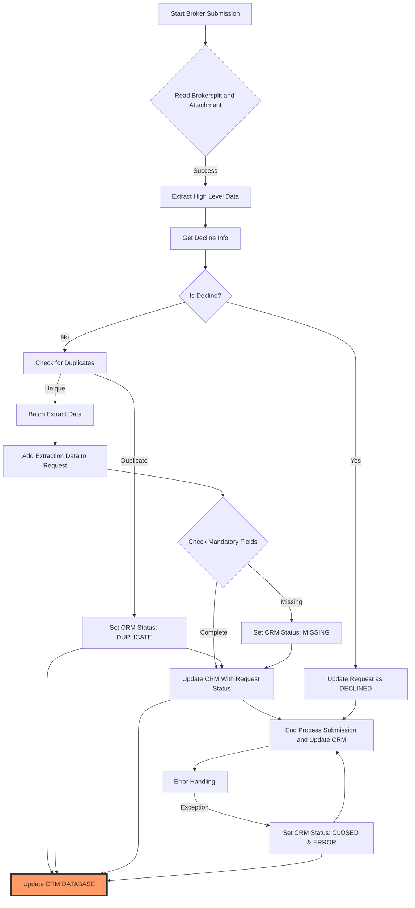
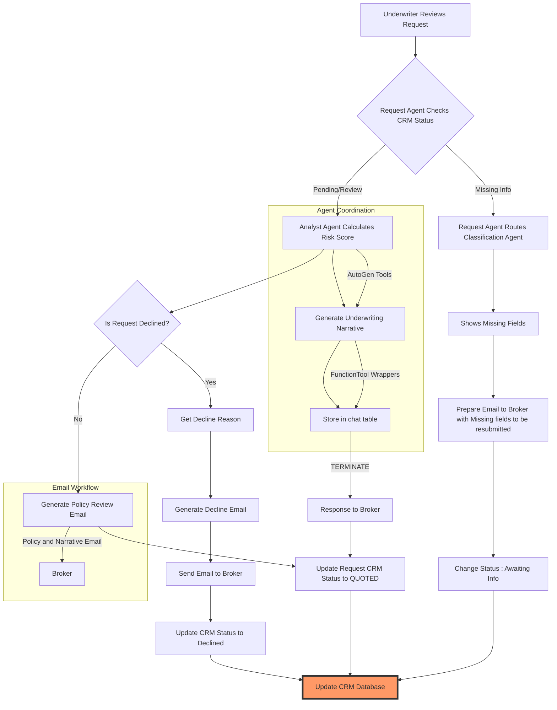

### Main Diff

- Litestar based ASGI framework with SAQ - Queue based document
processing
- Uploaded documents are stored safely in S3-Compatible Minio
storage and they can be shared securely.
- Documents are processed in queue without blocking the server.
- Documents are extracted in several filters , which reduce
context by a lot and current demo can be done without vector
database - giving better accuracy and context awarness for LLMs

#### **Key Advantages**  

1. **LLM-Driven Automation**:  
   - **Anthropic Claude Sonnet 3.5**: Extracts structured data from broker slips (e.g., coverage limits, client details) and analyzes emails for intent (e.g., quote requests, claim updates).  
   - **AutoGen + Clean-Text**: Coordinates multi-agent workflows (e.g., slip parsing → underwriting → response drafting) and preprocesses documents/emails for accuracy.  

2. **Scalable, Async Processing**:  
   - **Litestar (ASGI)**: Handles concurrent requests from brokers (e.g., uploading slips, submitting emails) with low-latency APIs.  
   - **asyncpg + PostgreSQL**: Manages high-throughput writes/reads for broker data (e.g., tracking slip statuses, email threads).  
   - **saq (Redis-based Task Queue)**: Offloads heavy tasks (e.g., OCR on slips, NLP on emails) to background workers, ensuring UI responsiveness.  

3. **Secure, Structured Data Management**:  
   - **JWT + Redis**: Securely authenticates brokers and manages session data for sensitive operations (e.g., uploading slips).  
   - **Minio + aiofile**: Stores broker slips and email attachments in a scalable, encrypted object storage system.  
   - **Enums + SQLAlchemy**: Enforces consistency in data  

### Tech Stack  

- **LLM**: Anthropic Claude Sonnet 3.5 (for document analysis, risk assessment, and NLP tasks)  
- **Web Framework**: Litestar (async ASGI framework with JWT, Redis, Jinja2 plugins)  
- **ORM**: SQLAlchemy via Advanced Alchemy (async ORM for PostgreSQL)  
- **Database**: asyncpg (PostgreSQL async driver)  
- **Task Queue**: saq (Redis-based) for async file extraction and background processing  
- **File Handling**: aiofile (async file I/O) + Minio (S3-compatible storage for broker slips/emails)  
- **AI Integration**: AutoGen (multi-agent workflows), Anthropic (LLM interactions), clean-text (document preprocessing) , LiteLLM - Multi LLM API Proxy - which make us able to switch any LLM including Opensource LLMs for cost efficiency and total data security.
- **Caching**:  Redis (session management, caching)

#### Core Extraction Components:

- **Document Intake & Processing:** When documents are uploaded, they are added to a processing queue. This ensures that the system handles documents efficiently without slowing down the server. Advanced filtering techniques are used to focus on the most relevant parts of the document, which helps the AI understand the content better and faster.

- **Schema-Driven Data Extraction:** The system uses structured templates (like a checklist) to pull out specific information from documents. These templates ensure that the same data is captured consistently across all documents, making the process reliable and precise.

- **Risk & Appetite Scoring:** The system automatically evaluates the risk level of each application against predefined rules. This is similar to a scoring system that determines if the application is acceptable based on specific criteria, helping to make quick and accurate underwriting decisions.

- **Coverage Recommendations:** Based on the extracted data, the system suggests the most suitable insurance coverage options. This is like a personalized recommendation engine that optimizes policy terms and conditions to fit the applicant's needs.

- **Automated Communication:** If an application is declined or if more information is needed, the system automatically generates emails using pre-defined templates. This ensures that clients receive timely and accurate communication without manual intervention.

#### Technical Details

- **Schema-Based Extraction:**

  - Structured data is extracted from documents using predefined formats through Anthropic's API, ensuring consistent and accurate parsing.
  - Multiple data formats are processed simultaneously to efficiently extract information from various documents, improving overall performance.
  - Schema files in `schema/` directory define the structure of extracted data

- **Schema Processing:**

  - Complex nested data structures are converted into a simpler flat format to simplify processing and validation.

  - Simplified flat data structures are transformed back into complex hierarchical formats for further processing.

  - Schema files include:

- `high_level_info.json`: Defines the structure for high-level data extraction from documents, such as initial metadata and summary information.
- `broker_details.json`: Specifies the schema for extracting detailed information about brokers, including contact details and account information.
- `policy_info.json`: Outlines the structure for extracting policy-specific data, such as coverage terms, policy numbers, and effective dates.
- `risk.json`: Contains the schema for risk assessment data, including risk scores, underwriting criteria, and appetite thresholds.
- `loss_history(claims_details).json`: Defines the format for extracting historical loss data and claims details from documents.

- **Risk Assessment:**

  - Extracted data is analyzed against predefined rules to calculate a risk score, which informs underwriting decisions.
  - Applications are evaluated against predefined underwriting criteria using industry-specific risk parameters to determine suitability.
  - Detailed summaries of risk assessments and underwriting decisions are generated in a human-readable format for review.

- **Coverage Processing:**

  - Optimal insurance coverage options are suggested based on data extracted from documents using a language model.
  - Formal, structured documents outlining recommended coverage options are generated for use in policy creation.

- **Email Generation:**

  - Standardized email templates are created to notify brokers of declined submissions, including the reasons for the decision.
  - Email templates are generated to request missing information from brokers when required details are incomplete.
  - Pre-designed templates are used to generate dynamic email content with placeholders for personalized information.

- **Data Validation:**

  - Submissions are checked against predefined rejection criteria using data extracted from the documents.
  - Required fields for data validation are identified during the information extraction phase to ensure completeness.

----

### Extraction and Initial Declination Digram

----
### **Agentic Workflow Diagram**  

