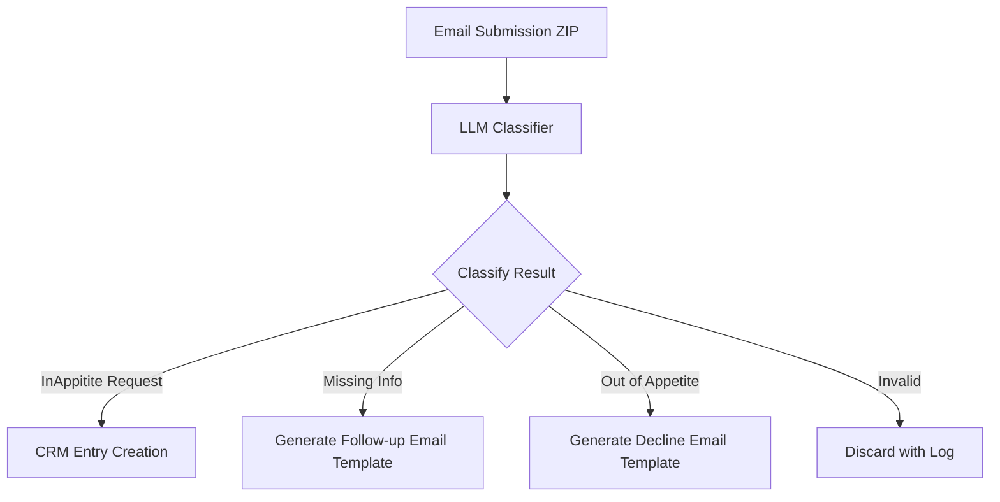
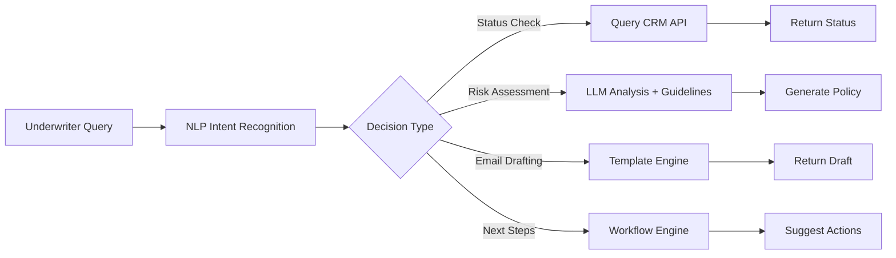
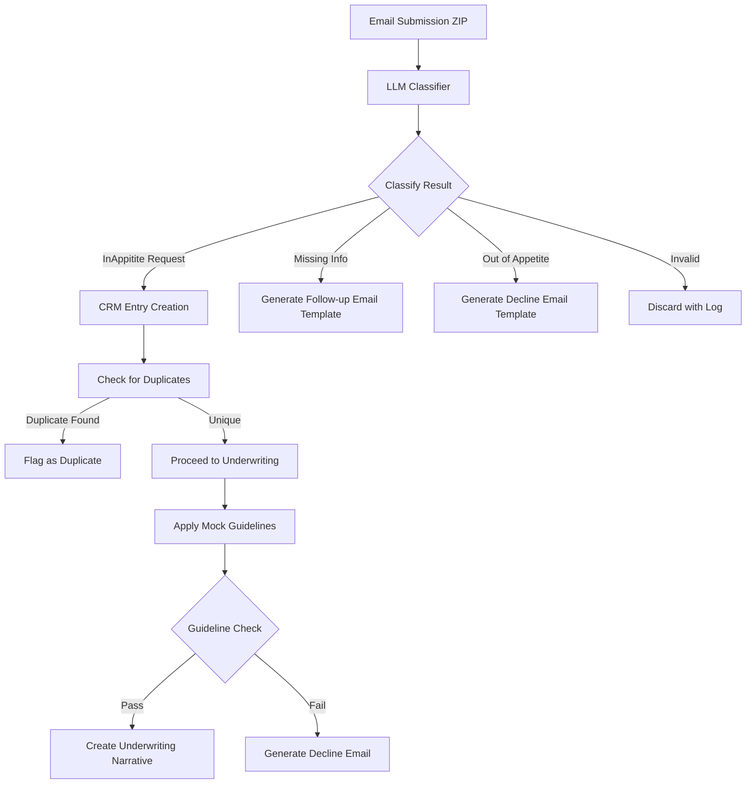

Here's the detailed plan for the LLM-powered classification and chatbot integration:

**1. Email Classification Pipeline**

**2. Chatbot Decision Engine Architecture**

**3. Implementation Details**

**LLM Workflow:**

- Use a claude or gemini for insurance submissions identification , structure data extraction, and Agentic Interaction
- Input: Extracted text from ZIP files
- Output: Structured JSON with classification and confidence scores
- Key classification
  - Valid Request
    - In Appetite
    - Missing Information
  - Invalid Request
    - Declined
    - Unrelated

**Chatbot Interaction Flow:**

1. **Initial Query**  
   Underwriter asks: "What's the status of submission XYZ?"

2. **LLM Analysis**  
   - Query CRM for submission data
   - Check against underwriting guidelines
   - Generate risk score

3. **Decision Making**  
   - If missing info:  
     "I noticed 3 missing fields in submission XYZ. Would you like me to draft a follow-up email to the broker?"
   - If out of appetite:  
     "Based on the guidelines, this submission is out of our risk appetite. Would you like me to generate a decline email?"
   - If valid:  
     "This submission meets our criteria. Shall I proceed with creating the underwriting narrative?"

4. **Action Execution**  
   - Confirm with underwriter
   - Auto-generate emails using templates
   - Update CRM status
   - Store decision rationale

**4. API Integration Points**

- `/api/chatbot/analyze` - For LLM-based submission analysis
- `/api/chatbot/suggest` - For next action suggestions
- `/api/chatbot/generate` - For email template generation
- `/api/chatbot/execute` - For executing approved actions

**5. Key Features**

- **Agentic Capabilities**: Chatbot can:
  - Initiate email drafting
  - Update CRM status autonomously
  - Generate underwriting narratives
  - Flag potential issues proactively

- **Natural Language Interface**:
  - "Check status of submission [ID] or given [Title]"
  - "Draft email for missing info in [ID] or given [Title]"
  - "Generate decline email for [ID] or given [Title]"
  - "Create underwriting narrative for [ID] or given [Title]"

- **Decision Transparency**:
  - Show confidence scores
  - Display rule matches from guidelines
  - Provide editable rationale

## Data

1. **Data Ingestion System**

- Create email parser to extract structured/unstructured data from submission documents
- Implement document anonymization process
- Develop data validation rules for required fields

2. **CRM Integration**

- Design database schema to store:

  - Customer information (name, address)
  - Line of Business (LoB)
  - Effectivity dates
  - Submission status
  - Risk assessment metadata

- Implement duplicate detection logic (nice-to-have)

3. **Underwriting Engine**

- Develop rule engine to compare submissions against:

  - Mock underwriting guidelines (from 'Guides/Hackathon_Underwriting Guideline Mock Rules.txt')
  - Zurich risk appetite document ('Guides/zurich-risk-appetite_mid-market-property (2).txt')

- Create decision tree for:

  - Missing information handling
  - Risk acceptance/rejection logic
  - Automated email generation system

4. **Data Processing Pipeline**

- Implement data structuring according to 'underwriting database' template
- Develop risk scoring algorithm
- Create underwriting narrative generator

5. **Supporting Infrastructure**

- Set up document processing workflow
- Implement email templating system
- Create audit logging system for decisions

**Key Additions:**

1. Duplicate detection after CRM entry creation
2. Explicit reference to mock underwriting guidelines
3. Updated decision flow to include guideline checks
4. Added underwriting narrative generation step

Would you like me to:

1. Add the duplicate detection logic to the implementation details?
2. Reference the specific mock guideline document?
3. Update the chatbot decision engine to include guideline checks?
4. Add risk scoring algorithm details?

This will ensure our plan fully addresses all requirements including the mock underwriting guidelines.
