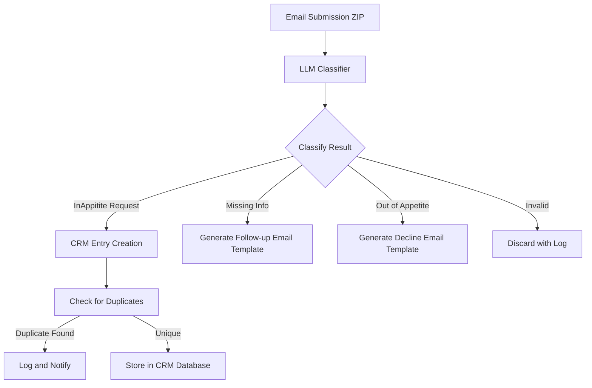
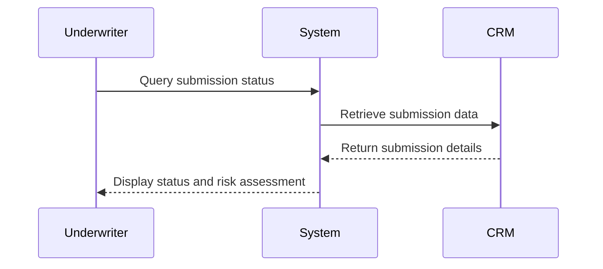
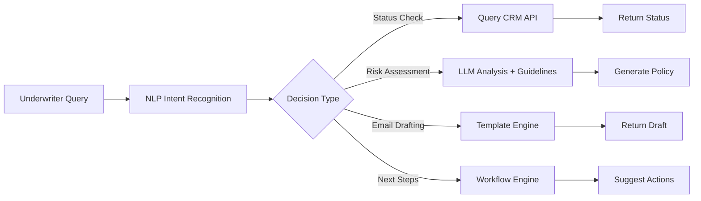
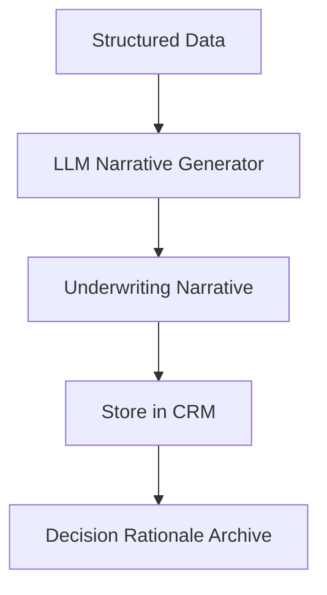
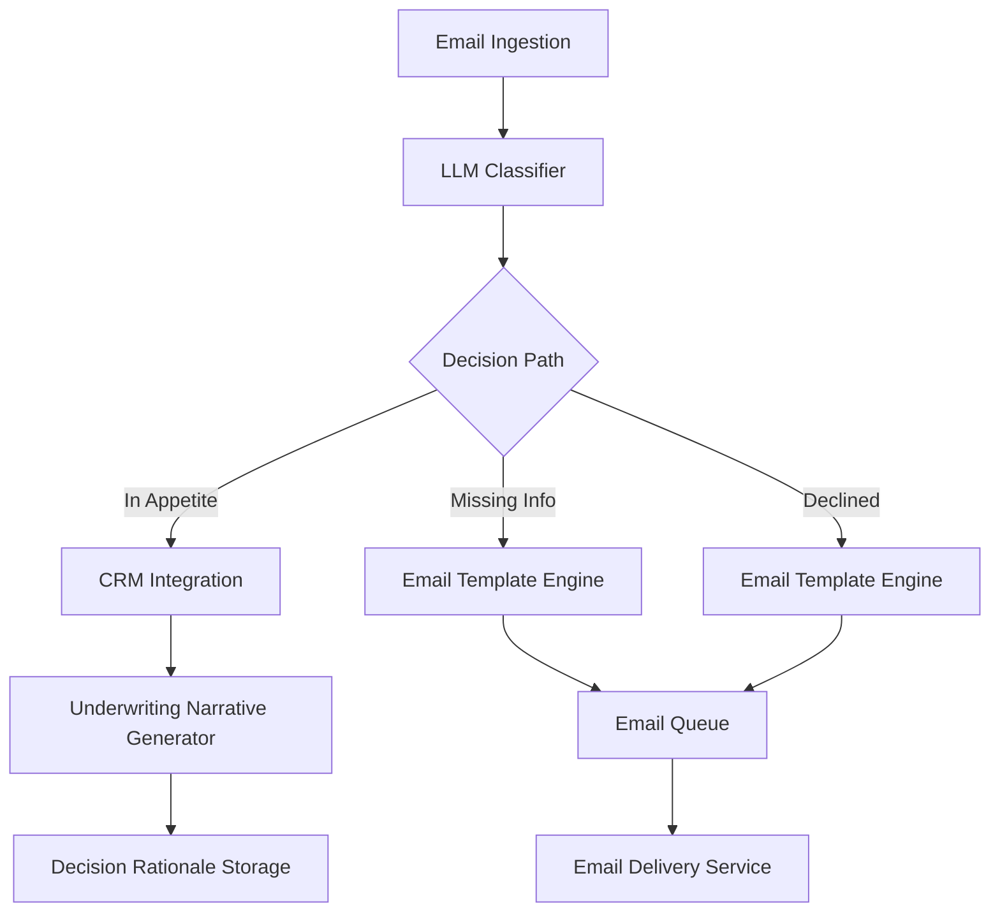
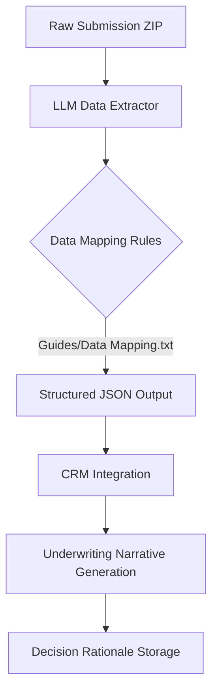

# Agentric : Zurich Insurance Hackathon Project Plan

## 1. Email Processing Pipeline


## 2. CRM Integration


## 3. Risk Assessment Workflow


## 4. Underwriting Narrative Generation


## 5. System Architecture


### Implementation Details

**Workflow:**
- Insurance Submissions Identification
- Structured Data Extraction and Entry Enrichment
- Agentic Chatbot Interaction

#### Insurance submissions identification
- Input: Extracted text from ZIP files
- Output: Structured JSON with classification and confidence scores
- Key classification
  - Valid Request
    - In Appetite
    - Missing Information
  - Invalid Request
    - Declined
    - Unrelated

#### CRM Entry Enrichment
- Extract customer name, address, LoB, effectivity date, submission status
- Design database schema to store:
  - Customer information (name, address)
  - Line of Business (LoB)
  - Effectivity dates
  - Submission status
  - Risk assessment metadata
- Store in CRM database with unique identifiers
- Implement duplicate checking mechanism

```python
from sqlalchemy import (
    Integer, 
    String, 
    Text, 
    Numeric, 
    JSON, 
    DateTime, 
    CheckConstraint, 
    UniqueConstraint,
    ForeignKey
)
from sqlalchemy.orm import (
    Mapped, 
    mapped_column, 
    relationship
)
from typing import Optional, List, Dict
from datetime import datetime

Base = declarative_base()

class Opportunity(Base):
    __tablename__ = 'opportunities'
    
    opportunity_id: Mapped[int] = mapped_column(Integer, primary_key=True)
    customer_name: Mapped[str] = mapped_column(String(255), nullable=False)
    customer_address: Mapped[str] = mapped_column(Text, nullable=False)
    line_of_business: Mapped[str] = mapped_column(String(100), nullable=False)
    effectivity_date: Mapped[Optional[datetime]] = mapped_column(DateTime)
    submission_status: Mapped[str] = mapped_column(
        String(50),
        CheckConstraint("submission_status IN ('Pending', 'In Review', 'Duplicate', 'Declined', 'Approved')"),
        nullable=False
    )
    broker_commission: Mapped[Optional[str]] = mapped_column(String(50))
    quote_due_date: Mapped[Optional[datetime]] = mapped_column(DateTime)
    construction_type: Mapped[Optional[str]] = mapped_column(String(100))
    post_code: Mapped[Optional[str]] = mapped_column(String(20))
    fire_protection_details: Mapped[Optional[str]] = mapped_column(Text)
    abn: Mapped[Optional[str]] = mapped_column(String(20))
    current_insurer: Mapped[Optional[str]] = mapped_column(String(100))
    interested_parties: Mapped[Optional[str]] = mapped_column(Text)
    fire_crime_split: Mapped[Optional[str]] = mapped_column(String(50))
    fire: Mapped[Optional[float]] = mapped_column(Numeric(10, 2))
    crime: Mapped[Optional[float]] = mapped_column(Numeric(10, 2))
    declared_values_section1: Mapped[Optional[int]] = mapped_column(Integer)
    declared_values_section2: Mapped[Optional[int]] = mapped_column(Integer)
    number_of_claims: Mapped[Optional[int]] = mapped_column(Integer)
    claim_numbers: Mapped[Optional[str]] = mapped_column(Text)
    loss_dates: Mapped[Optional[str]] = mapped_column(Text)
    created_at: Mapped[datetime] = mapped_column(DateTime, default=datetime.utcnow)
    
    # Unique constraint for duplicate detection
    __table_args__ = (
        UniqueConstraint('customer_name', 'customer_address', 'post_code', 'construction_type', name='uq_customer_info'),
    )
    
    # Relationship to underwriting data
    underwriting_data: Mapped[List["UnderwritingData"]] = relationship(back_populates="opportunity")

class UnderwritingData(Base):
    __tablename__ = 'underwriting_data'
    
    data_id: Mapped[int] = mapped_column(Integer, primary_key=True)
    opportunity_id: Mapped[int] = mapped_column(
        Integer, 
        ForeignKey('opportunities.opportunity_id'), 
        nullable=False
    )
    risk_score: Mapped[Optional[float]] = mapped_column(Numeric(5, 2))
    underwriting_narrative: Mapped[Optional[str]] = mapped_column(Text)
    risk_assessment_criteria: Mapped[Optional[Dict]] = mapped_column(JSON)
    submission_date: Mapped[datetime] = mapped_column(DateTime, default=datetime.utcnow)
    risk_appetite_rationale: Mapped[Optional[str]] = mapped_column(Text)
    guidelines_applied: Mapped[Optional[Dict]] = mapped_column(JSON)
    decline_reason: Mapped[Optional[str]] = mapped_column(
        String(100),
        CheckConstraint("decline_reason IN ('post_code', 'wood_construction', 'inception_date', 'min_value')"),
        nullable=True
    )
    
    # Relationship back to opportunity
    opportunity: Mapped["Opportunity"] = relationship(back_populates="underwriting_data")
    
    __table_args__ = (
        UniqueConstraint('opportunity_id', name='uq_opportunity_id'),
    )
```

#### Decline Rule Integration
- **Quick Decline Rules**:
  1. **Post Code Knockout**:
     - Check if `post_code` is in knockout list (2060, 3000, 4000)
     - If match, set `decline_reason = 'post_code'` and generate decline email
  2. **Wood Construction**:
     - If `construction_type = 'Wood'`, set `decline_reason = 'wood_construction'` and generate decline email
  3. **Inception Date**:
     - If `effectivity_date > quote_due_date`, set `decline_reason = 'inception_date'` and generate decline email
  4. **Minimum Declared Value**:
     - If `total_declared_value < 5000000`, set `decline_reason = 'min_value'` and generate decline email

- **Email Template Integration**:
  - Use templates from `Guides/Decline Scenarios and Wording.txt` based on `decline_reason`
  - Example for `decline_reason = 'post_code'`:
    ```python
    decline_email = """
    Thank you for your quotation submission for the above-mentioned customer.
    We advise that Zurich will not be offering a quotation in this instance due to the following reason:
    The geographical location of the declared asset is outside our current underwriting appetite.
    Thank you for the opportunity to review and we look forward to considering other opportunities in the future.
    Should you like to further discuss, please contact your local Zurich property underwriter.
    """
    ```

#### Agentic Chatbot Interaction
1. **Initial Query**  
   Underwriter asks: "What's the status of submission XYZ?"

2. **LLM Analysis**  
   - Query CRM for submission data
   - Check against underwriting guidelines
   - Generate risk score

3. **Decision Making**  
   - If decline rule triggered:  
     "Based on the guidelines, this submission is out of our risk appetite. Would you like me to generate a decline email?"
   - If valid:  
     "This submission meets our criteria. Shall I proceed with creating the underwriting narrative?"

4. **Action Execution**  
   - Confirm with underwriter
   - Auto-generate emails using templates
   - Update CRM status
   - Store decision rationale

#### Underwriting Guidelines Integration
- Reference: `Guides/Hackathon_Underwriting Guideline Mock Rules.txt`
- Implementation:
  1. Parse and normalize guideline rules
  2. Create rule engine for automated risk assessment using LLM
  3. Integrate with decision engine for real-time guideline checks
  4. Store guideline references in CRM for audit purposes

#### Risk Scoring Algorithm
- Factors:
  - Property value
  - Location risk profile (Flood Zone: Moderate Risk, Earthquake-Prone Area: Low Risk, Windstorm Area: High Risk)
  - Coverage type
  - Underwriting guidelines match score
  - Construction type (Wood: High Risk, Brick: Medium Risk, Steel: Low Risk)
  - Fire protection (Sprinklers: Yes (Effective), Alarms: Yes (Effective), Fire Department Proximity: Within 5 miles (Optimal))
  - Historical claims (Number of Claims in Last 5 Years: 2, Total Claim Amount: $50,000)
- Output: Quantitative risk score (0-100)
- Thresholds:
  - <60: Automatic decline
  - 60-80: Manual review required
  - >80: Acceptable risk

#### Underwriting Narrative Generation
- Template-based generation using:
  - Structured data from submission
  - Risk score analysis
  - Guideline compliance status
- Output: Justification document for underwriting decision
- Format: Markdown with executive summary and technical details


## 6. Structured Data Extraction Pipeline with LLM



### Implementation Details

**Process ofr LLM based Structured Data Extraction:**

Extract structured data from insurance submission documents following the schema in Guides/Data Mapping.txt.

1. Parse all text from ZIP file contents
2. Identify and extract the following data categories:
   - Broker Details (Company, Name, Location, Contact, Commission)
   - Insured Details (ABN, Business Description, Current Insurer)
   - Policy Info (Period, Product Type, Fire/Crime Split)
   - Policy Coverage (Declared Values, Limits of Liability)
   - Risk Details (Number of locations, Construction type, Fire protection)
   - Loss History (Claims details if applicable)

3. Map extracted data to the following schema:
   - Data Type: str/int/float/date as specified in Guides/Data Mapping.txt
   - Mandatory Fields: Mark as required in the schema
   - Aliases: Use alternative names from "Aliases (Data Extraction)" column

4. Return structured JSON with the following format:
   {
     "broker": { ... },
     "insured": { ... },
     "policy": { ... },
     "coverage": { ... },
     "risk": { ... },
     "claims": { ... }
   }

5. For fields marked "Data Extraction Required? = Yes":
   - Use exact field names from the schema
   - Include all sub-fields where applicable
   - Use "N/A" for optional fields with no data

6. For "Possible Source" fields:
   - Prioritize data from Email/Quote Slip
   - Use Asset Schedule for property-specific details

7. Handle special cases:
   - For "Date" fields: Use ISO format (YYYY-MM-DD)
   - For "Yes/No" fields: Use boolean values
   - For "str/int" fields: Use numeric values where applicable
   - For "float" fields: Use 2 decimal places
   - For "JSON" fields: Use proper JSON format

8. Validate against the schema in Guides/Data Mapping.txt
9. Return only the structured JSON output with no additional text

### Key Components
- **Input:** Extracted text from ZIP files
- **LLM Processing:** 
  - Follows strict schema from Guides/Data Mapping.txt
  - Generate JSON Schema for each Categoreis
  - Handles nested data structures (e.g., policy coverage sections)
  - Applies data type conversions (str/int/float/date)
- **Output:** 
  - Structured JSON with all required fields
  - Null/empty values for optional fields with no data
  - Proper formatting for special data types
- **Integration:** 
  - Directly feeds into CRM database
  - Enables underwriting narrative generation
  - Supports risk assessment workflow


## Additional Implementation Requirements That further exploration

- **Duplicate Checking Implementation**
  - Use a combination of:
    - Hash-based comparison of submission content
    - Fuzzy matching on customer name + address
    - CRM field comparison: customer name, address, LoB, effectivity date, post code, construction type
  - Store unique identifiers in CRM with SHA-256 hashes of submission content
  - Flag duplicates with "DUPLICATE" status in CRM

- **Underwriting Guidelines Integration**
  - According to `Guides/Hackathon_Underwriting Guideline Mock Rules.txt` Flag entry with and adjust appetite according to:
    - Industry-specific risk profiles (from risk appetite document)
    - Construction type restrictions (wood construction is explicitly excluded)
    - Location-based criteria (post code knockout lists)
    - Value thresholds ($5M minimum declared value)
  - Implement rule engine using LLM:
    - Decision tree for quick decline rules
    - Weighted scoring for risk appetite factors
    - Reference all applied guidelines in CRM audit log

- **Email Template Management**
  - Store templates in `Guides/Decline Scenarios and Wording.txt` with:
    - 4 predefined decline templates matching quick decline rules
    - Dynamic placeholders for:
      - Customer name
      - Policy inception date
      - Declared values
      - Post codes
      - Construction types
  - Use template engine to auto-generate emails with proper wording

- **LLM Chatbot Architecture**
  - Implement with:
    - RAG system for underwriting guidelines
    - CRM API integration via MCP for submission status checks
    - Risk scoring module using:
      - Industry risk profiles
      - Asset age/condition
      - Physical protection factors
      - Claims history
  - Use LLM for:
    - Natural language query understanding
    - Risk rationale generation
    - Decision justification documentation

- **Folder/Document Naming Conventions**
  - Implement folder structure rules and document naming conventions from `Folder and Document Naming Conventions Property.txt`:
    - Folder Structure: `CUSTOMER/YEAR/LOB`
    - Document Naming: `Document Type + Customer Name + Date + Version` (e.g., `Aussie Company Pty Ltd 20250606 v1`)
    - Sub Folder Document Types: `Broker Corro`, `Internal Corro`, `LOA`, `LOAuth`, `File Notes`, `RNL / NB Strategy`, `RNL Slip`, `NB Slip`, `ENDT Slip`, `ENDT Info`, `BI Calc`, `BI Info`, `LOL Calc`, `Claims History`, `Product & Company Information`, `IDES Worksheet`, `IDES`, `Actuarial`, `Agg Deduct`, `ERM`, `RNL Quote`, `NB Quote`, `ENDT Quote`, `Wording Proposal - Quote`, `RNL Schd`, `NB Schd`, `ENDT Schd`, `COC`, `Placing Slip`, `Closing`, `Compliance Corro`, `SD Exempt`, `RIQA Corro`, `Claims Rep mid term`, `TP Survey`, `Brkr Survey`, `RI Corro`, `RI Cert`
